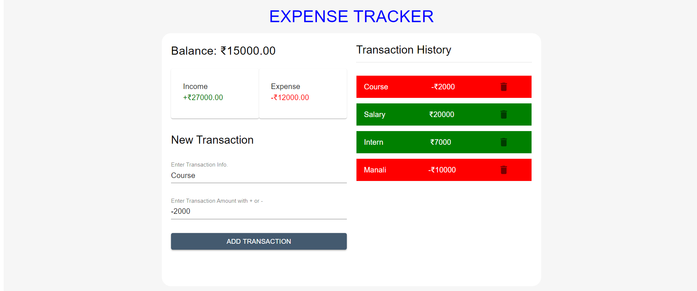

# TRANSACTION TRACKER
An application which lets you track and manage all your transactions.
 
User can record both income and expenses here and thus also see what is their balance at a particular instant.
 
A handy application which everyone should have.
 
 
Visit the Website : https://weather-app-assassin1771.netlify.app/

 
 
 

### Installation and Setup Instructions

Clone down this repository. You will need node and npm installed globally on your machine.

Installation:
 
npm install

To Run Test Suite:
 
npm test

To Start Server:
 
npm start

To Visit App:
 
http://localhost:3000
 
 
 
This is one of the basic projects which every Web Developer desires to build.
 
I built this project using React JS, ES6, CSS3 and html5.
 
The website is fully responsive and compatible on all devices.
